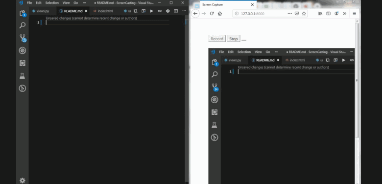

# ScreenCapture
OpenCV screen frame capture

This module/application uses OpenCV to capture images and write them as *.avi video format, with each capture the python generator is used to get the image in matrices form with the help of numPy. The generate image (generator image) viewed at the browser and changed itself with each capture.

### Module Used
* OpenCV # capture the image and write them in *.avi
* NumPy # Used by OpenCV to capture the image as matrices
* Pillow # Image capture module
* Django # work as a server
* Python Generator # built in functionality yield uses to point the last image

To run the Application

install modules as in `requirements.txt`

**In Settings.py**

Add module

`'screen.apps.ScreenConfig',`

